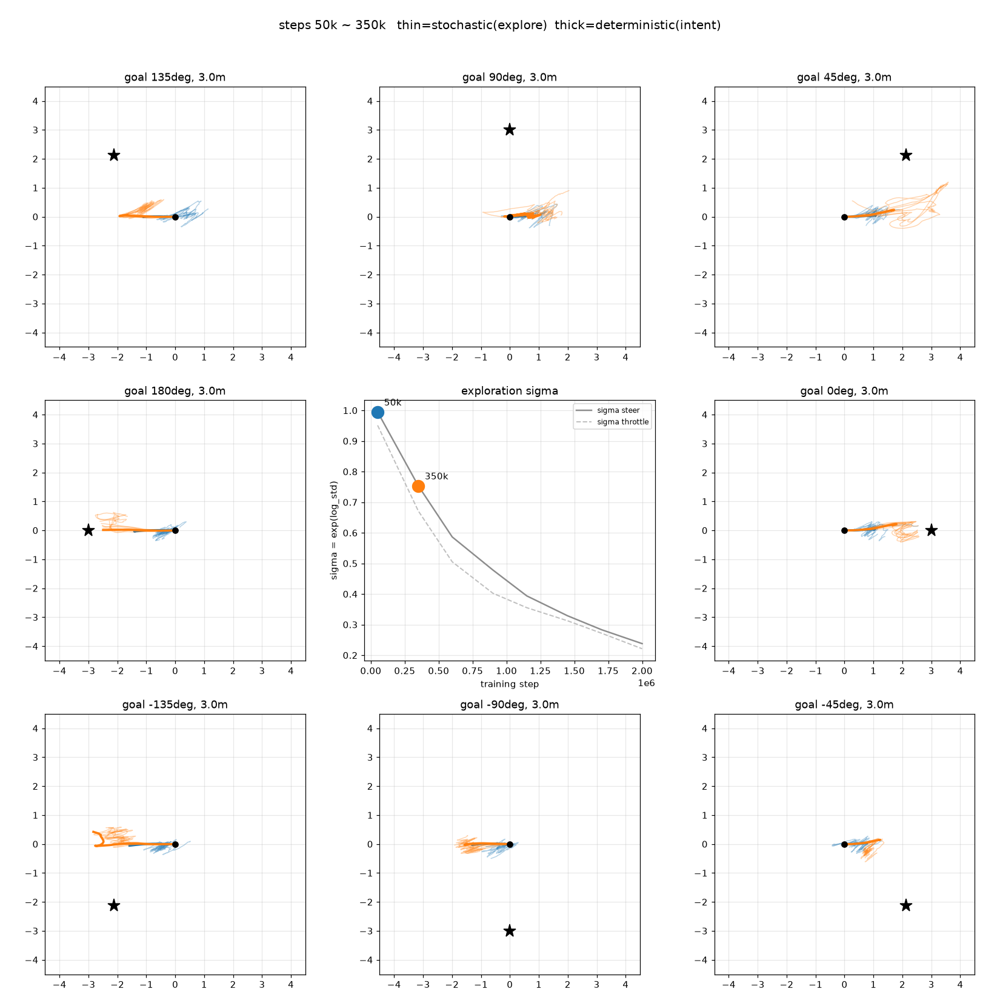
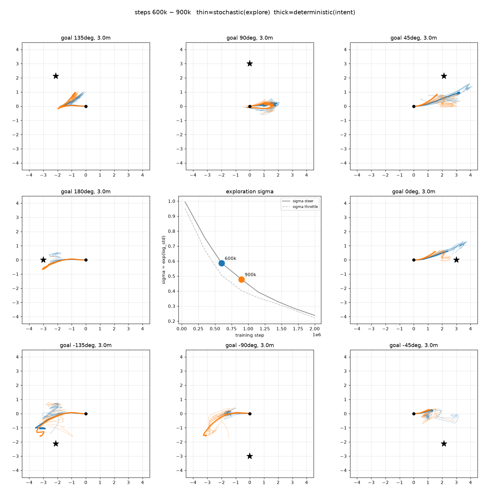
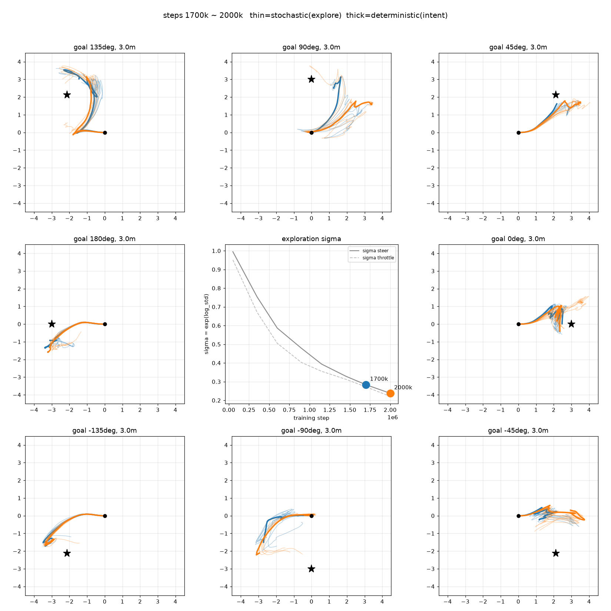

# 학습 경과에 따른 탐험 수준·양상

> 수치(각도별 도달률)로는 "옆을 못 간다"까지만 알 수 있다.
> **학습이 진행되며 정책이 얼마나, 어떤 식으로 탐험하는지** 보려고 궤적을 시각화.
> 대상: exp01-00-baseline (목표 2~4m, 2M steps, **seed 0 단일 run**)
> 관련: viz/, docs/2026-07-20_experiment__exp01_easy_goal.md · 작성: 2026-07-20

---

### 어떻게 봤나

체크포인트 40개 중 8개를 균등 추출해, 각 시점 정책을 **고정 조건**에서 실행.

- 조건: heading 기준 8방향(0·±45·±90·±135·180°), 목표 3m
- **stochastic 8회**(탐험 폭 = 궤적 다발의 퍼짐) + **deterministic 1회**
- **지형 seed 고정** — 지형이 매번 다르면 stochastic noise와 지형 차이가 섞여 탐험 수준 파악이 어려울 것이라 판단
- **σ = exp(log_std)** 도 함께 기록

### 관찰

σ는 학습 동안 단조 감소 (steer 0.99 → 0.24). 구간별 궤적:

| 구간 | σ (steer) | 궤적 |
|---|:---:|---|
| 50k ~ 350k | 0.99 → 0.75 | 원점 근처에서 진동, **순변위 거의 없음** |
| 600k ~ 900k | 0.59 → 0.48 | **앞뒤로 확실히 이동 시작**, 옆은 여전히 못 감 |
| 1.7M ~ 2M | 0.28 → 0.24 | 매끈한 큰 호, 다발이 좁음, 도달 방향은 한쪽에 몰림 |

---

## 인사이트 1 — 주행 방향과 회전 방향의 편향

↓ 최종 정책, deterministic, seed 0~4, 목표 3m
| goal | throttle 평균 | 전진 비율 | steer 평균 | steer>0 비율 |
|---|---:|---:|---:|---:|
| +135° | +0.03 | 44% | −0.24 | 25% |
| +90° | +0.25 | 68% | +0.19 | 63% |
| +45° | +0.47 | 73% | +0.14 | 59% |
| 0° | +0.15 | 55% | +0.13 | 59% |
| −45° | +0.17 | 60% | +0.21 | 65% |
| −90° | −0.24 | 45% | −0.16 | 37% |
| −135° | −0.52 | 9% | −0.20 | 39% |
| 180° | −0.32 | 25% | −0.08 | 44% |

-45° ~ 135°: 전진 & 왼쪽 조향
180° ~ -90°: 후진 & 오른쪽 조향
**주행 방향과 회전 방향이 결합된 편향**이 보이며, 모든 경우에 대해 동일한 회전 방향(시계반대방향)으로 움직인다.

> 다만 부호 비율이 59~65% 수준인 각도도 있어 **"항상"은 아니고 평균적 치우침**이다.

## 인사이트 2 — 초기 궤적의 고착화

학습이 진행됨에 따라 더 멀리 주행하고 회전하는 행동을 보이지만, 초기의 진행 루트를 후반에도 답습하는 경향이 보인다.

예를 들어, 135° 케이스에서, 학습 초기에는 '후진'을 시도, 이후에는 '후진 한 뒤에 전진하며 왼쪽 조향'을 시도한다. 학습 초기의 '후진'이 이후의 학습에 계속 영향을 주고, 완전 다른 방식의 탐험이 보이지 않는다. 0° 케이스에서도, 초기 약간의 좌방향 전진이 학습 후기에도 나타난다.

초기엔 σ≈1이라 action이 거의 난수여서 매 스텝 방향이 뒤집히고, **변위가 서로 상쇄돼 제자리에 머문다.** σ가 줄며 μ가 드러나 궤적이 길고 매끈해진다.

→ 즉 **σ가 크더라도 제자리 주위를 머물며 넓게 탐험하지 못했다.**

---

## 결론 — 탐험 부족

> 초반에 한쪽 회전으로 약간의 보상을 얻음 → 그 주변에서 노이즈가 손해라 σ가 줄어듦
> → 반대 방향 회전을 시도할 기회가 줄어듦 → 회전 편향이 고정된 채 **주행 완결성만 향상**.
