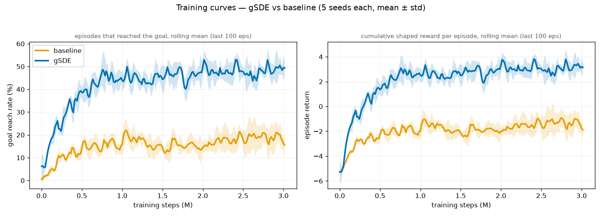
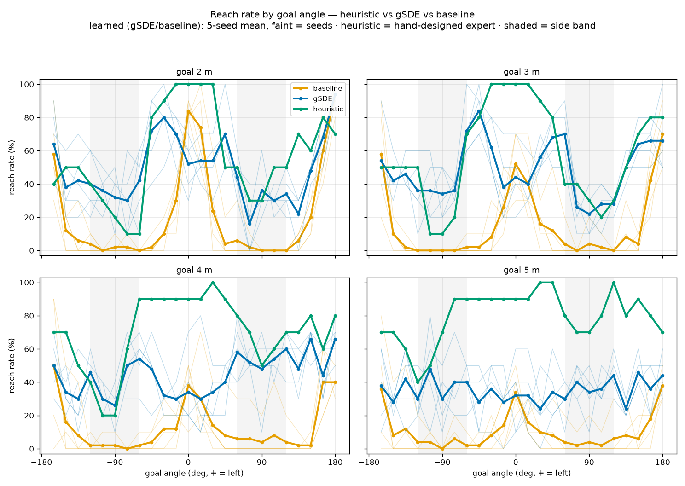
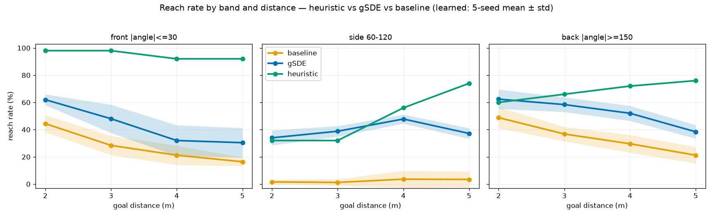
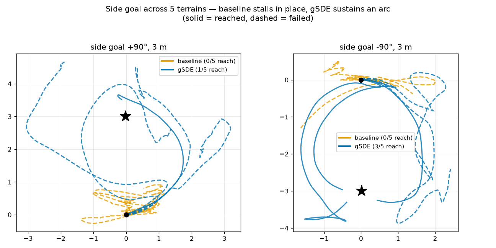
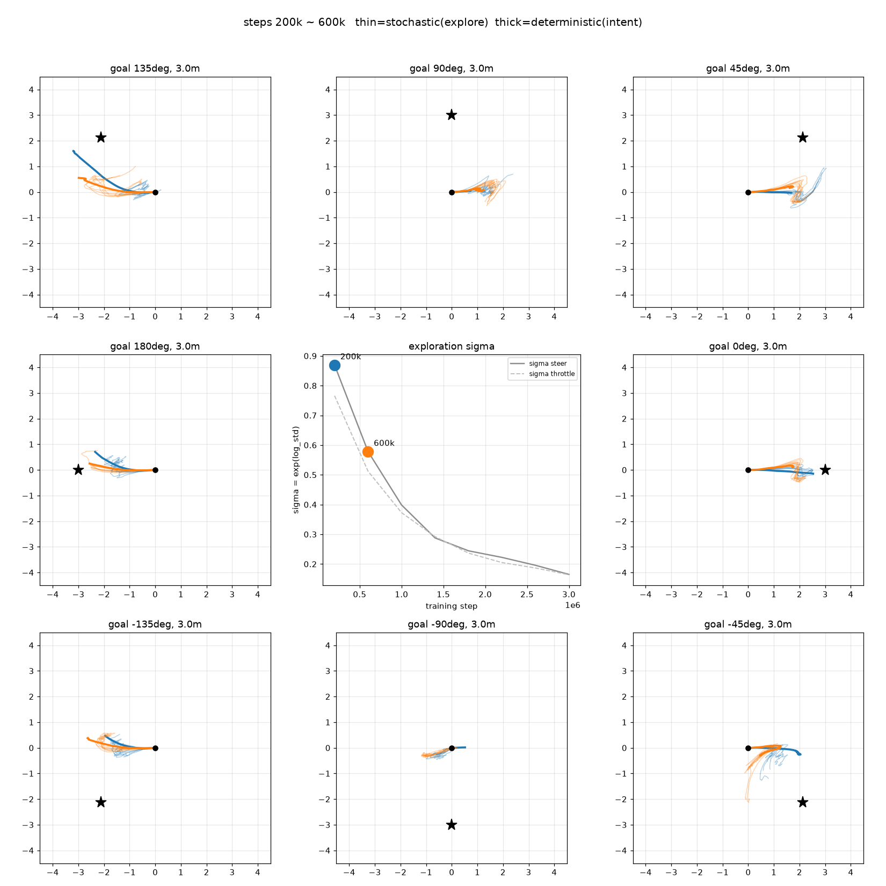
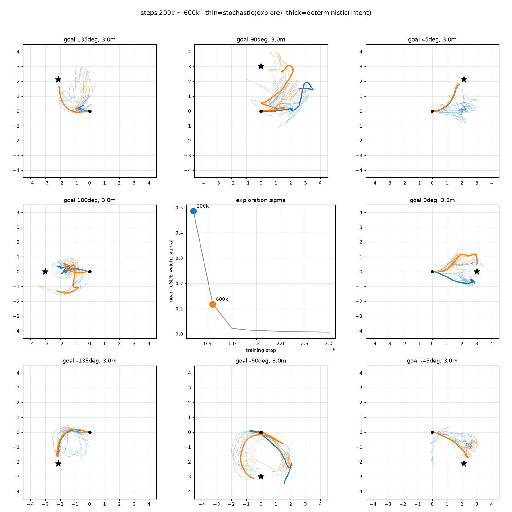

# 탐험 개선 — 조사 및 실험 기록

> 옆 방향 실패의 원인을 탐험 부족으로 진단, 탐험 노이즈를 변경하여 탐험 개선 시도

---

### 문제

매 스텝 독립적인 가우시안 노이즈는 관성·조향지연이 있는 이 계에서 전-후, 좌-우 **노이즈가 상쇄**되며 멀리 탐험하지 못한다. (초기 σ≈1인데 제자리 떨림이 증거). 
일정 시간 동안은 한 방향으로 동일한 노이즈를 부여해야 멀리 탐험할 수 있을 것이다.

### 조사 — 방법 계열

| 방법 | 메모 |
|---|---|
| **gSDE** | `sde_sample_freq`마다만 노이즈 갱신 → 지속적·부드러운 탐험. **SB3 PPO 네이티브** |
| OU 노이즈 | off-policy(DDPG/TD3)용 → PPO 부적합 |

gSDE 권고: `use_sde=True`, `sde_sample_freq` **8~16**

- cf.
  - [Smooth Exploration for Robotic RL (gSDE, Raffin 2022)](https://proceedings.mlr.press/v164/raffin22a/raffin22a.pdf)
  - [Latent(Lattice) Exploration, NeurIPS 2023](https://proceedings.nips.cc/paper_files/paper/2023/file/b0ca717599b7ba84d5e4f4c8b1ef6657-Paper-Conference.pdf)
  - [State-Novelty Guided Action Persistence, 2024](https://arxiv.org/pdf/2409.05433)

 

---

### 실험 (Exp04)

baseline(exp02 seed1\~5, 3M) vs gSDE(exp04 seed1\~5, 3M) — `use_sde`만 격리, 나머지 동일.
참조로 **휴리스틱**(BC의 expert: goal 방향으로 조향+전진하는 무학습 규칙)도 같은 조건으로 평가해 상한을 가늠한다.

평가는 `policy_eval.py`로 목표 거리 2·3·4·5m × 각도 15°(24개) × 지형 seed 10개(100\~109), deterministic.
동일 지형 집합을 세 그룹이 공유해 공정 비교(지형은 seed로 재현). 학습 정책 수치는 **모델 seed 5개 평균±표준편차**
(휴리스틱은 무학습 규칙이라 seed 밴드 없음).

 

### 결과
#### ① Training Curves - 더 빠르게, 더 높은 성능 달성

goal 도달률(학습 중, 랜덤 목표)이 gSDE ~48% vs baseline ~17%, return도 +3 vs −2로 뚜렷하게 더 높은 성능을 보인다. gSDE가 초반 상승도 더 가파르다.

둘 다 ~1M에서 plateau. 주행 궤적이 비효율적이고 실패하는 경우가 많아서 최적에 도달한 것은 아님.

 

#### ② 각도별 성공률 - 측면 대폭 개선, 직진 축에서만 소폭 후퇴

baseline은 정면(0°)·후방(±180°) 축에서만 성공하는 "W자"이고 **옆(음영)에서 0으로 추락**한다.

**gSDE는 측면 도달률을 대폭 개선**한다. 

밴드 평균으로는 **앞·뒤도 gSDE가 baseline보다 높다**(위 표). 다만 **정확히 직진 축 방향에서만 baseline에 소폭 뒤진다** —
3m 기준 0°(gSDE 44 vs base 52)·180°(66 vs 70)·-165°(54 vs 58). 직진/후진해도 될 상황에 불필요하게 호를 그리는 부작용이다.

이는 **탐험 부족이 아니라 호에 편향된 정책으로 수렴한 결과**로 보인다 — baseline은 탐험이 더 약한데도 이 축들에선 더 낫기 때문이다.
gSDE는 (탐험을 더 해) 호를 찾아냈지만, 그 호를 직진 축에까지 과일반화했고, 0°에서 살짝 돌아도 결국 도달해 보상 차이가 작아 교정 압력이 약했던 것으로 추정된다.

**Heuristic과 비교하면, 대부분의 방향에서 성공률이 더 낮다.** 정/후방에 대해 특히 차이가 크고, 측면에 대해서는 비슷하거나, 오히려 높은 성공률을 보이기도 한다.

전/후/측면 각도 범위별로 보면:

| 거리 | 앞 (heur/base/gSDE) | **옆 (heur/base/gSDE)** | 뒤 (heur/base/gSDE) |
|---|:---:|:---:|:---:|
| 2m | 98 / 44 / 62 | **32 / 2 / 34** | 60 / 49 / 62 |
| 3m | 98 / 28 / 48 | **32 / 1 / 39** | 66 / 37 / 58 |
| 4m | 92 / 21 / 32 | **56 / 4 / 48** | 72 / 30 / 52 |
| 5m | 92 / 16 / 30 | **74 / 3 / 37** | 76 / 21 / 38 |

 

- **[좌우 편향]** 다중 seed 평균에서 좌우 도달률 차이는 baseline +2.2%p(12.2 vs 10.0), gSDE +0.1%p(43.4 vs 43.3)로 **사실상 없다**(개별 seed의 좌우 차 평균도 5%p 미만). 과거 단일 seed(exp00-05)의 극단 편향(75 vs 10)은
seed 특유의 학습 우연으로 보임. (재현 코드: `analysis/exp04_gsde/exp04_gsde.ipynb`)

 

#### Side goals 궤적 차이

옆(±90°) 목표를 보면, **baseline은 원점에서 제자리 떨림**(지속 조향 실패), gSDE는 **호**를 그리며 접근한다. 

학습 초반 탐험 궤적을 살펴보면, baseline은 진동하며 좁은 영역을 탐험하는 반면, gSDE는 일정 step동안 noise 방향을 유지한 덕분에 훨씬 넓은 지역을 탐험할 수 있었다.

한편, σ는 ~1M에서 붕괴하므로 **탐험은 초반 창에 몰리고**, 이후엔 발견한 호를 다듬는다.

 

### 결론

진단(화이트 노이즈가 느린 변수에서 상쇄 → 지속 조향 미탐험)이 예측한 그대로, **시간상관 탐험(gSDE)을 주자 옆 방향 주행이 대폭 개선되었다**(옆 1\~4 → 34\~48%, 다중 seed 재현). 순수 RL의 병목이 표현력·물리가 아니라 **탐험**이었음을 5 seed로 확증한다.

다만 **직진 축 방향(0°·180°)에서는 baseline에 소폭 뒤지는데**, 직진해도 될 상황에 호를 그리는 **호 편향 정책으로 수렴한 부작용**이다(앞/뒤 밴드 평균은 gSDE가 더 높다).
또, gSDE는 **손으로 짠 휴리스틱 expert엔 못 미친다**(전체 ~40 vs 66%).